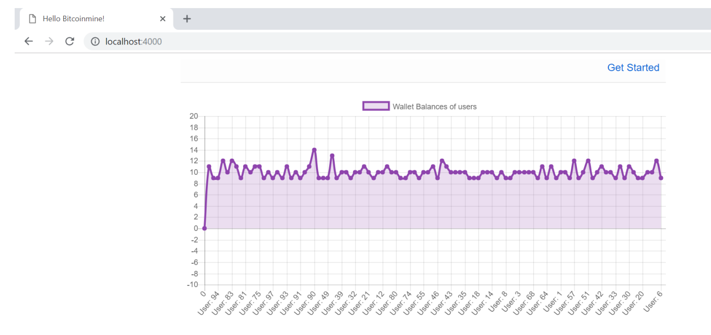

# Bitcoin network

The aim of this project is to design and simulate a network in which the participants transact bitcoins like in the real world. Although the project doesn't address all the requirements, it surely covers the trivial parts of the bitcoin network. It is necessary to first understand what a bitcoin is and the technology on which the bitcoin has been developed. Following are few links that can be followed to gain an insight of this mysterious and often misunderstood cryptocurrency.

1. [What is a bitcoin?](https://www.youtube.com/watch?v=Um63OQz3bjo)
2. [Which is the driving technology of a bitcoin?](https://www.youtube.com/watch?v=SSo_EIwHSd4)
3. [How do I transact using a bitcoin?](https://www.youtube.com/watch?v=Em8nJN8IEes)

## Steps to run the project

I have used Visual studio code as editor while coding for this project. It has an built in support for syntax and filling suggestion for Elixir. This can be got by installing an [additional package](https://marketplace.visualstudio.com/items?itemName=mjmcloug.vscode-elixir) along with Visual studio code.

You should have [Elixir](https://elixir-lang.org/install.html) and [Phoenix framework](https://hexdocs.pm/phoenix/installation.html) installed on your system to run the following project on your system. Clone this repository into your system and run the following commands

`mix phx.new somefilename`

_WARNING_: In my project, the project name is test. It is advised that you use the same name while creating the phoenix project. If you use any other name, you will have to change the name in all the files that you will be replacing.

This will create a phoenix project for you with the name somefilename. It will already have many files inside it. You can refer this page for more information on [mix](https://elixir-lang.org/getting-started/mix-otp/introduction-to-mix.html).

Copy all the files in elixir folder from the downloaded folder and paste it inside the lib folder inside your somefilename project. The files inside the elixir folder are [bitcoin_main.ex](Elixir_files/bitcoin_main.ex), [bitcoin_user.ex](Elixir_files/bitcoin_user.ex), [bitcoin_miner.ex](Elixir_files/bitcoin_miner.ex), [bitcoin_miningtask.ex](Elixir_files/bitcoin_miningtask.ex), [bitcoin_block.ex](Elixir_files/bitcoin_block.ex).

Now you will need to replace the following files inside this project. This is to design the frontend.

- app.html.eex inside lib/somefilename_web/layout with the [app.html.eex](Phoenix_files/app.html.eex) in the Phoenix_files. 
- index.html inside lib/somefilename_web/page with [index.html.eex](Phoenix_files/index.html.eex) in the Phoenix_files.
- page_controller.ex file in lib/somefilename_web/controllers with [page_controller.ex](Phoenix_files/page_controller.ex) in Phoenix_files.
- socket.js file in assets/js with the [socket.js](Phoenix_files/socket.js) in Phoenix_files.
- room_channel.ex in lib/somefilename_web/channels with the [room_channel.ex](Phoenix_files/room_channel.ex) in Phoenix_files.
- user_socket.ex in lib/somefilename_web/channels with the [user_socket.ex](Phoenix_files/user_socket.js) in Phoenix_files.
- endpoint.ex in lib/somefilename_web with [endpoint.ex](Phoenix_files/endpoint.ex) in Phoenix_files.

    See this [video](https://www.youtube.com/watch?v=e5jlIejl9Fs) or refer its [code and explanation](https://gist.github.com/yaycode/58ff8213ea54d7272ae89d0b9165be16) to get a fair idea on what exactly these file does.

Once this is done, run the following command to start a local server at the address https://localhost:4000

`mix phx.server`

_If the code is taking a long time to run, refresh the online page once and the code should run at once. After running this command you will be able to see that the code has run in the backend as well as in the frontend. In the backend you will see the result in the form of print statements and in the frontend you will see a graph being plotted at the IP mentioned above._

## Design of the project

The project can be mainly divided into the frontend and backend portion. The backend is written in Elixir and the frontend is written using html and javascript libraries like chart.js in phoenix framework.

The users who does the transaction and the miners are treated as seperate participants by design. This design has been followed to make the network resemble the real world where the probability of the same participant being transacter and miner is very less.  

Backend files:

1. [bitcoin_main.ex](Elixir_files/bitcoin_main.ex):
    This is the main file. It contains the logic to do all the work done by the network. The creation of all the users and miners is initiated by this file based on the scenarios. This file has an additional logic written for creating bitcoin address for using in wallet, although it hasn't been used for now.

2. [bitcoin_user.ex](Elixir_files/bitcoin_user.ex):
    This file contains the logic for the users to do the transactions. The users select another participant randomly in the network and sends one bitcoin to it. The sender and receiver updates their wallets correspondingly. The receiver after validating the digital signature of the sender, uploads the transaction to the global unverified list for the miners to validate it.

3. [bitcoin_miner.ex](Elixir_files/bitcoin_miner.ex):
    This file contains the logic for initializing a miner. The miner will create a task that does the mining. The miner will also kill its task if the transaction it is working on is already mined.

4. [bitcoin_miningtask.ex](Elixir_files/bitcoin_miningtask.ex): 
    This file contains the logic for the actual work of the miner. The difficulty level for mining a bitcoin is set here. Also, this file is resposible for the miner to send the newly created block to all the users and miners.

5. [bitcoin_block.ex](Elixir_files/bitcoin_block.ex): 
    This file defines the structure of the block in the bitcoin blockchain network. The fields to be present in the blocks are mentioned here. The default values for the fields are hardcoded to aid in the creation of a genesis block. These fields will be overwritten while creating subsequent blocks in the blockchain. 

Refer the comments in the above files for a detailed explanation of the design.

## Result

This is how the page will look once the code runs successfully.

## Author Information
1. Shreyas Gaadikere Sreedhara, Email - shreyasgaadikere@ufl.edu
2. Nirali Patel, Email - niralipatel@ufl.edu

